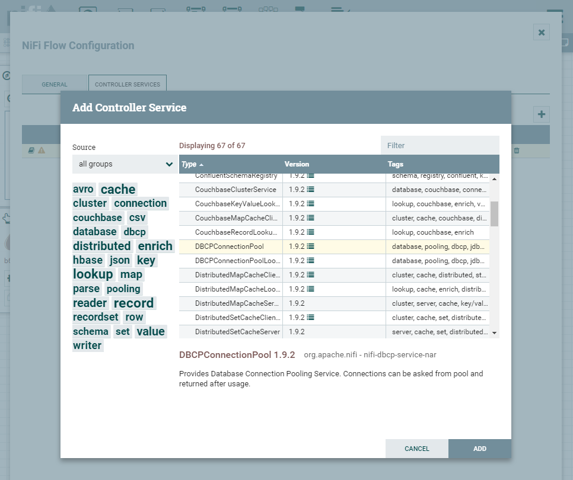
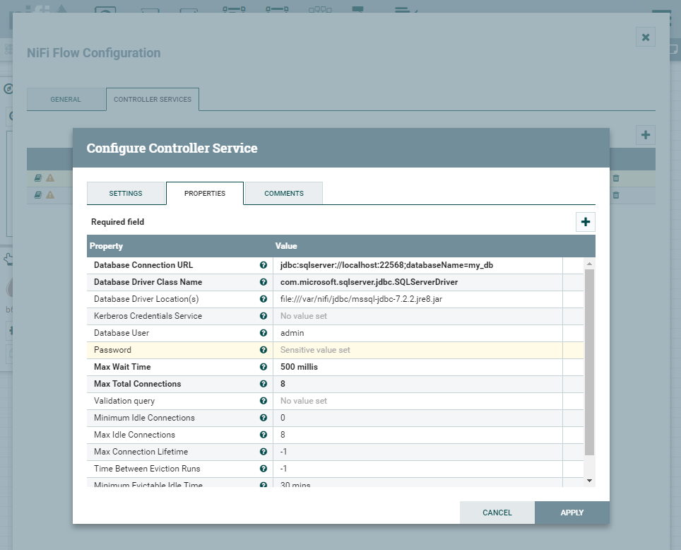

# fea17e86/nifi-extended

This image extends [apache/nifi](https://hub.docker.com/r/apache/nifi) by a new volume `JDBC_DRIVERS` located in `var/nifi/jdbc`. How to use it:

## Example configuration for MSSQL Server

1. Run this image (example: [docker-compose.yml](./docker-compose.yml)) and mount `var/nifi/jdbc` to a folder on your host system that contains the jdbc drivers
2. Go to the nifi web administration
3. Right click on the canvas and select `Configure`
4. Add a new controller service and select type `DBConnectionPool`
5. Open the configuration panel of the new controller service and add the necessary connection information
   - Database Connection URL: `jdbc:sqlserver://localhost:22568;databaseName=my_db`
   - Database Driver Class Name: `com.microsoft.sqlserver.jdbc.SQLServerDriver`
   - Database Driver Location(s): `file:///var/nifi/jdbc/mssql-jdbc-7.2.2.jre8.jar`
   - Database User: `<user_name>`
   - Password: `<password>`

